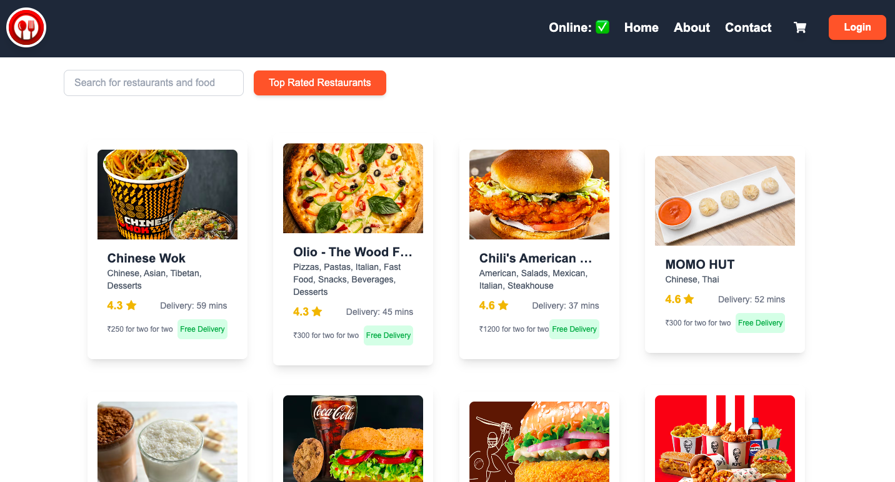
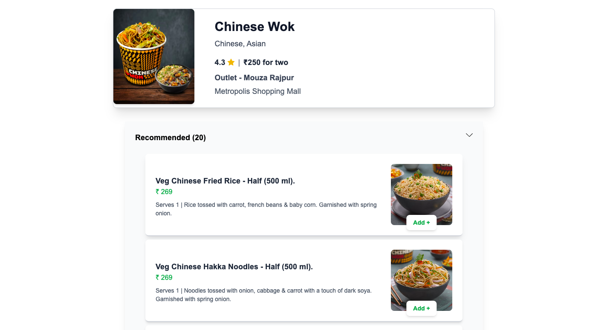
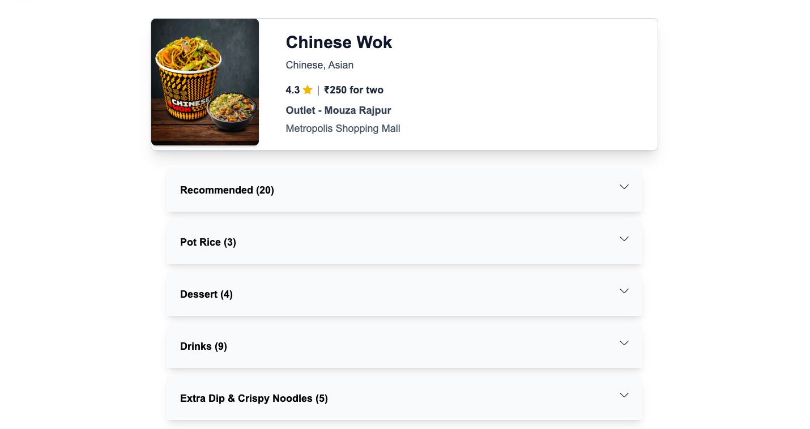
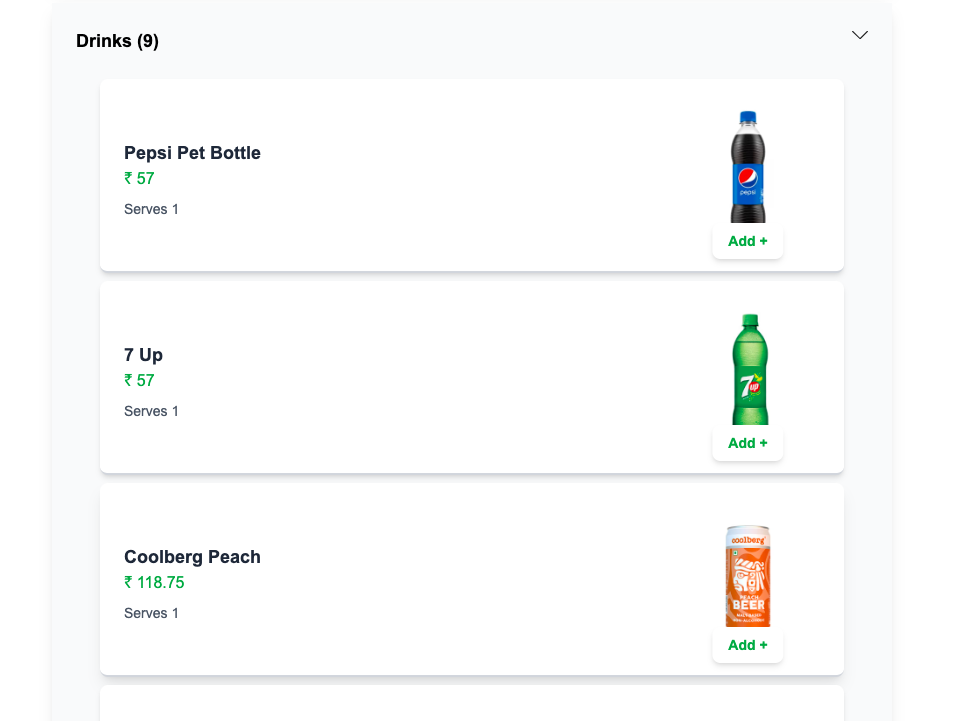

# 🍽️ Swiggy Clone – ReactJS Frontend

A modern food delivery frontend application inspired by Swiggy, built using React. This clone replicates key functionalities of the original Swiggy app, including restaurant listing, dynamic menus, cart management, and responsive design.

---

## 🚀 Features

- 🏬 Restaurant listing with live data
- 🍱 Menu fetching for individual restaurants
- 🛒 Cart add/remove functionality
- 🔍 Search bar for restaurants
- 📱 Fully responsive design
- 🌐 API-based rendering using Swiggy’s (unofficial) public API

---

## 🛠️ Tech Stack

- **Frontend:** React.js
- **Styling:** Tailwind CSS
- **Routing:** React Router DOM
- **State Management:** useState, useContext
- **Tools:** VS Code, Git, GitHub
- **API:** Swiggy live API (unofficial)

---

## 📸 Screenshots

### 🏠 Homepage – Restaurant Listings



---

### 🍽️ Restaurant Menu Page



---

### 🛒 Menu Accordian View



---

### 📱 Accordian Items View



---

> 📝 All screenshots are stored in `/screenshots/` directory of this project.

---

## 📦 Getting Started

Follow these steps to run the project locally:

### 1. Clone the repository
```bash
git clone https://github.com/your-username/swiggy-clone.git
cd swiggy-clone

### 2. Install dependencies
npm install

### 3. Start the development server
npm start

App will run on:
http://localhost:3000


🙌 Acknowledgements
Inspired by Swiggy
Swiggy Live API (unofficial)
UI elements adapted for learning and demonstration purposes

📄 License
This project is open-source and free to use for learning purposes. Not intended for commercial use.
